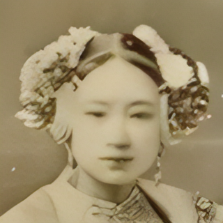

# BSRGAN-PyTorch

## Overview

This repository contains an op-for-op PyTorch reimplementation
of [Designing a Practical Degradation Model for Deep Blind Image Super-Resolution](https://arxiv.org/pdf/2103.14006v2.pdf)
.

## Table of contents

- [BSRGAN-PyTorch](#bsrgan-pytorch)
    - [Overview](#overview)
    - [Table of contents](#table-of-contents)
    - [Download weights](#download-weights)
    - [Download datasets](#download-datasets)
    - [How Test and Train](#how-test-and-train)
        - [Test BSRGAN_x4 model](#test-bsrgan_x4-model)
        - [Train BSRNet_x4 model](#train-bsrnet_x4-model)
        - [Resume train BSRNet_x4 model](#resume-train-bsrnet_x4-model)
        - [Train BSRGAN_x4 model](#train-bsrgan_x4-model)
        - [Resume train BSRGAN_x4 model](#resume-train-bsrgan_x4-model)
    - [Result](#result)
    - [Contributing](#contributing)
    - [Credit](#credit)
        - [Designing a Practical Degradation Model for Deep Blind Image Super-Resolution](#designing-a-practical-degradation-model-for-deep-blind-image-super-resolution)

## Download weights

- [Google Driver](https://drive.google.com/drive/folders/17ju2HN7Y6pyPK2CC_AqnAfTOe9_3hCQ8?usp=sharing)
- [Baidu Driver](https://pan.baidu.com/s/1yNs4rqIb004-NKEdKBJtYg?pwd=llot)

## Download datasets

Contains DIV2K, DIV8K, Flickr2K, OST, T91, Set5, Set14, BSDS100 and BSDS200, etc.

- [Google Driver](https://drive.google.com/drive/folders/1A6lzGeQrFMxPqJehK9s37ce-tPDj20mD?usp=sharing)
- [Baidu Driver](https://pan.baidu.com/s/1o-8Ty_7q6DiS3ykLU09IVg?pwd=llot)

Please refer to `README.md` in the `data` directory for the method of making a dataset.

## How Test and Train

Both training and testing only need to modify the `bsrnet_config.py` or `bsrgan_config.py` file.

### Test BSRGAN_x4 model

Modify the `bsrgan_config.py` file.

- line 48: `g_model_arch_name` change to `bsrgan_x4`.
- line 60: `upscale_factor` change to `4`.
- line 62: `mode` change to `test`.
- line 64: `exp_name` change to `BSRGAN_x4-Set5`.
- line 118: `lr_dir` change to `f"./data/Set5/LRbicx{upscale_factor}"`.
- line 119: `gt_dir` change to `f"./data/Set5/GTmod12"`.
- line 121: `g_model_weights_path` change to `./results/pretrained_models/BSRGAN_x4-DIV2K-6d507222.pth.tar`.

```bash
python3 test.py
```

### Train BSRNet_x4 model

Modify the `bsrnet_config.py` file.

- line 48: `g_model_arch_name` change to `bsrgan_x4`.
- line 60: `upscale_factor` change to `4`.
- line 62: `mode` change to `train`.
- line 64: `exp_name` change to `BSRNet_x4-DIV2K`.

```bash
python3 train_bsrnet.py
```

### Resume train BSRNet_x4 model

Modify the `bsrnet_config.py` file.

- line 48: `g_model_arch_name` change to `bsrgan_x4`.
- line 60: `upscale_factor` change to `4`.
- line 62: `mode` change to `test`.
- line 64: `exp_name` change to `BSRNet_x4-DIV2K`.
- line 74: `resume_g_model_weights_path` change to `./samples/BSRNet_x4-DIV2K/g_epoch_xxx.pth.tar`.
- line 118: `lr_dir` change to `f"./data/Set5/LRbicx{upscale_factor}"`.
- line 119: `gt_dir` change to `f"./data/Set5/GTmod12"`.

```bash
python3 train_bsrnet.py
```

### Train BSRGAN_x4 model

Modify the `bsrgan_config.py` file.

- line 47: `d_model_arch_name` change to `discriminator_unet`.
- line 48: `g_model_arch_name` change to `bsrgan_x4`.
- line 60: `upscale_factor` change to `4`.
- line 62: `mode` change to `train`.
- line 64: `exp_name` change to `BSRGAN_x4-DIV2K`.

```bash
python3 train_bsrgan.py
```

### Resume train BSRGAN_x4 model

Modify the `bsrgan_config.py` file.

- line 47: `d_model_arch_name` change to `discriminator_unet`.
- line 48: `g_model_arch_name` change to `bsrgan_x4`.
- line 60: `upscale_factor` change to `4`.
- line 62: `mode` change to `train`.
- line 64: `exp_name` change to `BSRGAN_x4-DIV2K`.
- line 83: `resume_d_model_weights_path` change to `./samples/BSRGAN_x4-DIV2K/d_epoch_xxx.pth.tar`.
- line 84: `resume_g_model_weights_path` change to `./samples/BSRGAN_x4-DIV2K/g_epoch_xxx.pth.tar`.
- line 118: `lr_dir` change to `f"./data/Set5/LRbicx{upscale_factor}"`.
- line 119: `gt_dir` change to `f"./data/Set5/GTmod12"`.

```bash
python3 train_bsrgan.py
```

## Result

Source of original paper results: [https://arxiv.org/pdf/2103.14006v2.pdf](https://arxiv.org/pdf/2103.14006v2.pdf)

In the following table, the psnr value in `()` indicates the result of the project, and `-` indicates no test.

- RealSRSet

| Model  | Scale |      NIQE      | 
|:------:|:-----:|:--------------:|
| BSRNet |   2   |  -(**7.25**)   |
| BSRGAN |   2   |  -(**6.39**)   |
| BSRNet |   4   |  -(**8.06**)   |
| BSRGAN |   4   | 5.60(**5.50**) |

```bash
# Download `BSRGAN_x4-DIV2K-6d507222.pth.tar` weights to `./results/pretrained_models`
# More detail see `README.md<Download weights>`
python3 ./inference.py
```

Input:

<span align="center"></span>

Output:

<span align="center"></span>

```text
Build `bsrgan_x4` model successfully.
Load `bsrgan_x4` model weights `./results/pretrained_models/BSRGAN_x4-DIV2K-6d507222.pth.tar` successfully.
SR image save to `./figure/oldphoto2_sr.png`
```

## Contributing

If you find a bug, create a GitHub issue, or even better, submit a pull request. Similarly, if you have questions,
simply post them as GitHub issues.

I look forward to seeing what the community does with these models!

## Credit

### Designing a Practical Degradation Model for Deep Blind Image Super-Resolution

_Zhang, Kai and Liang, Jingyun and Van Gool, Luc and Timofte, Radu_ <br>

**Abstract** <br>
It is widely acknowledged that single image super-resolution (SISR) methods would not perform well if the assumed
degradation model deviates from those in real images. Although several degradation models take additional factors into
consideration, such as blur, they are still not effective enough to cover the diverse degradations of real images. To
address this issue, this paper proposes to design a more complex but practical degradation model that consists of
randomly shuffled blur, downsampling and noise degradations. Specifically, the blur is approximated by two convolutions
with isotropic and anisotropic Gaussian kernels; the downsampling is randomly chosen from nearest, bilinear and bicubic
interpolations; the noise is synthesized by adding Gaussian noise with different noise levels, adopting JPEG compression
with different quality factors, and generating processed camera sensor noise via reverse-forward camera image signal
processing (ISP) pipeline model and RAW image noise model. To verify the effectiveness of the new degradation model, we
have trained a deep blind ESRGAN super-resolver and then applied it to super-resolve both synthetic and real images with
diverse degradations. The experimental results demonstrate that the new degradation model can help to significantly
improve the practicability of deep super-resolvers, thus providing a powerful alternative solution for real SISR
applications.

[[Paper]](https://arxiv.org/pdf/2103.14006v2.pdf) [[Code]](https://arxiv.org/pdf/2103.14006v2.pdf)

```bibtex
@inproceedings{zhang2021designing,
    title={Designing a Practical Degradation Model for Deep Blind Image Super-Resolution},
    author={Zhang, Kai and Liang, Jingyun and Van Gool, Luc and Timofte, Radu},
    booktitle={IEEE International Conference on Computer Vision},
    pages={4791--4800},
    year={2021}
}
```
